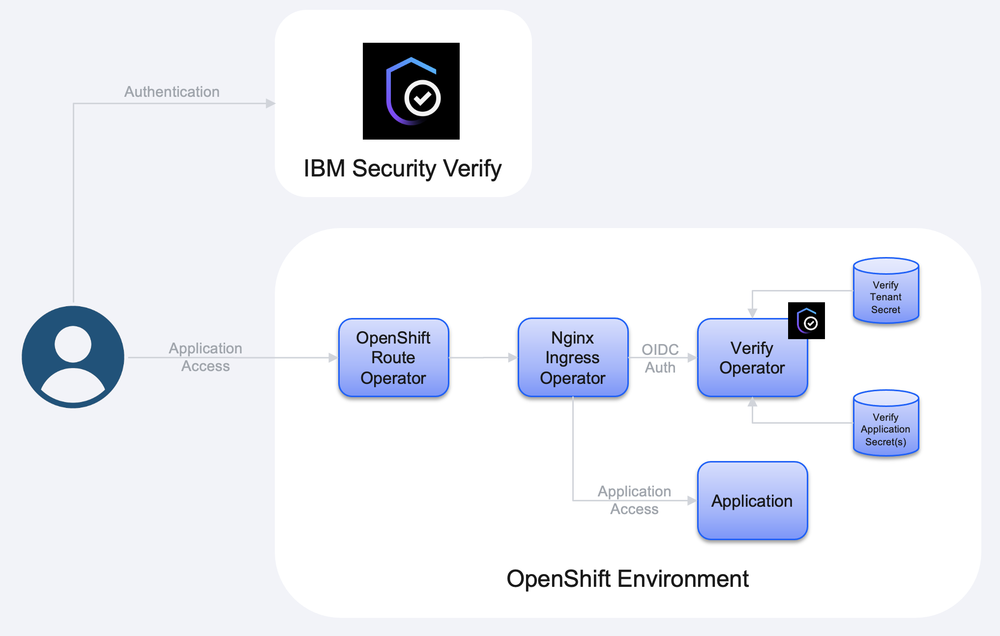
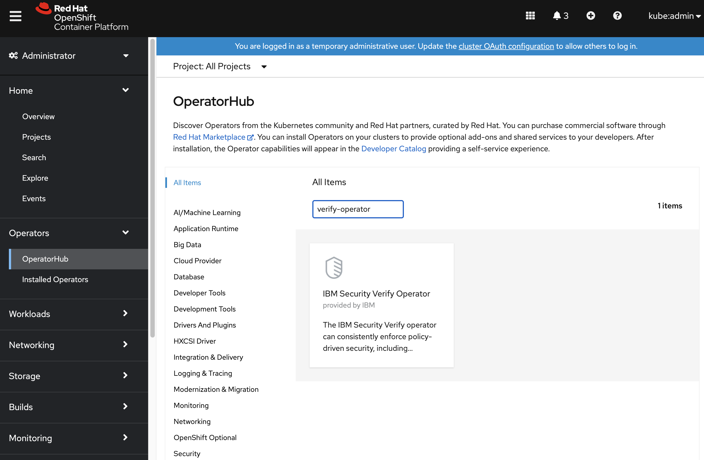
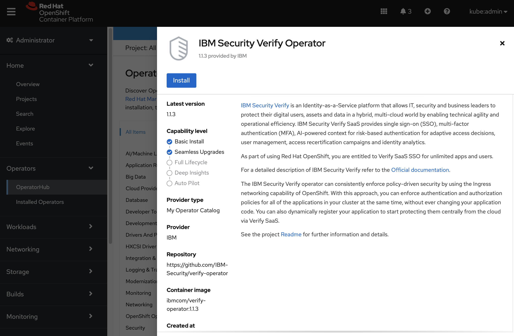
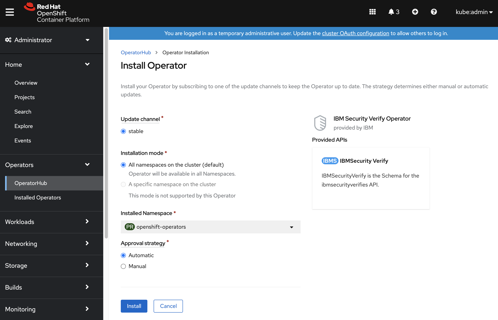

# IBM Security Verify Operator


- [Overview](#overview)
  * [Prerequisites](#prerequisites)
  * [Restrictions](#restrictions)
- [Architecture](#architecture)
  * [Components](#components)
  * [Flow](#flow)
- [Installation](#installation)
  * [Procedure](#procedure)
- [Configuration](#configuration)
  * [Secrets](#secrets)
  * [Configuring the Operator](#configuring-the-operator)
- [Usage](#usage)
  * [Creating a new Application](#creating-a-new-application)
    + [Self Registration](#self-registration)
    + [Manual Registration](#manual-registration)
  * [Creating an Ingress Resource](#creating-an-ingress-resource)


## Overview

[IBM Security Verify](https://www.ibm.com/products/verify-saas) is an Identity-as-a-Service platform that allows IT, security and business leaders to protect their digital users, assets and data in a hybrid, multi-cloud world by enabling technical agility and operational efficiency. IBM Security Verify SaaS provides single sign-on (SSO), multi-factor authentication (MFA), AI-powered context for risk-based authentication for adaptive access decisions, user management, access recertification campaigns and identity analytics.
 
For a detailed description of IBM Security Verify refer to the [Offical documentation](https://www.ibm.com/docs/en/security-verify).

The IBM Security Verify operator can consistently enforce policy-driven security by using the Ingress networking capability of OpenShift, in conjunction with the Nginx Ingress operator. With this approach, you can enforce authentication and authorization policies for all of the applications in your cluster at the same time, without ever changing your application code.  You can also dynamically register your application to start protecting them centrally from the cloud via IBM Security Verify SaaS. 

### Prerequisites

The are a number of prerequisites which must be met before the Verify operator can be installed and used, namely:

1. The operator supports the [RedHat OpenShift](https://www.redhat.com/en/technologies/cloud-computing/openshift) containerized environment and does not currently support other Kubernetes environments.  
2. The RedHat certified [Nginx Ingress operator](https://catalog.redhat.com/software/operators/detail/5e9874913f398525a0ceb00d) must be installed and the applications which are to be protected by IBM Security Verify must be accessed by the service which is provided by the Ingress controller.  Please note that this operator is different to the standard Kubernetes Nginx Ingress operator.  
3. An IBM Security Verify SaaS tenant is required. Those that make use of the IBM Security Verify operator can use [Verify SaaS SSO](https://www.ibm.com/account/reg/signup?formid=urx-51255) if they do not already have access to a tenant.  An IBM Security Verify SaaS tenant is required to provide authentication and adaptive access capabilities.  

### Restrictions

The restrictions on the usage of the operator include:

1. Only traffic which passes through the Nginx Ingress operator will be protected.  Any traffic which uses the native OpenShift Route or Ingress controller will not be protected.
2. The authorization-code flow is the only OIDC authentication flow which is supported.

## Architecture

### Components

The following diagram depicts the components which are used in the environment.  The 'OpenShift Route Operator' is not necessarily required in a cloud environment as the native cloud Load Balancer could be used as an alternative mechanism to ingress into the environment.



### Flow

OpenID Connect (OIDC) is used in the environment to pass single sign-on information from IBM Security Verify into the OpenShift environment.  The OIDC specification states that authentication can follow one of three paths: the Authorization Code Flow, the Implicit Flow, or the Hybrid Flow. The flow determines how the ID Token and Access Token are returned to the Client. The IBM Security Verify operator will only support the Authorization Code Flow, and the overall flow, incorporating single sign-on from IBM Security Verify, is described in the following scenario diagram.

[](https://mermaid-js.github.io/mermaid-live-editor/edit/#eyJjb2RlIjoic2VxdWVuY2VEaWFncmFtXG5wYXJ0aWNpcGFudCBVc2VyXG5wYXJ0aWNpcGFudCBJbmdyZXNzIGFzIE5naW54IEluZ3Jlc3NcbnBhcnRpY2lwYW50IE9wZXJhdG9yIGFzIFZlcmlmeSBPcGVyYXRvclxucGFydGljaXBhbnQgQXBwbGljYXRpb25cbnBhcnRpY2lwYW50IFZlcmlmeVxuICAgIFVzZXItPj4rSW5ncmVzczogUmVzb3VyY2UgUmVxdWVzdFxuICAgIG5vdGUgb3ZlciBJbmdyZXNzOiBOZ2lueCBkZXRlY3RzIHRoYXQgPGJyPmF1dGhlbnRpY2F0aW9uIGlzIHJlcXVpcmVkLlxuICAgIEluZ3Jlc3MtPj5PcGVyYXRvcjogR0VUIC9jaGVja1xuICAgIGFjdGl2YXRlIE9wZXJhdG9yXG4gICAgT3BlcmF0b3ItPj5JbmdyZXNzOiAzMDIgL2xvZ2luXG4gICAgSW5ncmVzcy0-Pk9wZXJhdG9yOiBHRVQgL2xvZ2luXG4gICAgbm90ZSByaWdodCBvZiBPcGVyYXRvcjogVGhlIG9wZXJhdG9yIGdlbmVyYXRlcyA8YnI-dGhlIE9JREMgcmVxdWVzdC5cbiAgICBPcGVyYXRvci0-PlVzZXI6IDMwMiBSZWRpcmVjdFxuICAgIGRlYWN0aXZhdGUgT3BlcmF0b3JcbiAgICBVc2VyLT4-K1ZlcmlmeTogQXV0aG9yaXphdGlvbiBFbmRwb2ludFxuICAgIG5vdGUgcmlnaHQgb2YgVmVyaWZ5OiBWZXJpZnkgcGVyZm9ybXMgPGJyPmF1dGhlbnRpY2F0aW9uXG4gICAgVmVyaWZ5LT4-LVVzZXI6IDMwMiBSZWRpcmVjdFxuICAgIFVzZXItPj4rT3BlcmF0b3I6IEdFVCAvYXV0aFxuICAgIE9wZXJhdG9yLT4-K1ZlcmlmeTogVG9rZW4gRW5kcG9pbnRcbiAgICBWZXJpZnktPj4tT3BlcmF0b3I6IFRva2Vuc1xuICAgIG5vdGUgcmlnaHQgb2YgT3BlcmF0b3I6IFRoZSBvcGVyYXRvciB2YWxpZGF0ZXM8YnI-dGhlIHRva2VuXG4gICAgT3BlcmF0b3ItPj4tVXNlcjogMzAyIFJlZGlyZWN0XG4gICAgVXNlci0-PitBcHBsaWNhdGlvbjogUmVzb3VyY2UgUmVxdWVzdFxuICAgIEFwcGxpY2F0aW9uLT4-LVVzZXI6IFJlc291cmNlIFJlc3BvbnNlXG4gICAgICAgICAgICAiLCJtZXJtYWlkIjoie1xuICBcInRoZW1lXCI6IFwiZGVmYXVsdFwiXG59IiwidXBkYXRlRWRpdG9yIjpmYWxzZSwiYXV0b1N5bmMiOnRydWUsInVwZGF0ZURpYWdyYW0iOmZhbHNlfQ)

### Logout

It is possible to logout an authenticated session by sending a GET request to the '/logout' URL segment within the configured authentication URL.  For example, if the `ssoURL` field within the IBMSecurityVerify custom resource is set to `/verify-sso` the logout URI would be: `/verify-sso/logout`.  Upon successful logout the user will be redirected to the logout redirect URL which is specified in the IBMSecurityVerify custom resource.  Please note that if a logout redirect URL is not specified in the custom resource the logout mechanism is disabled.

## Installation

Kubernetes operators are very useful tools that provide lifecycle management capabilities for many varying custom objects in Kubernetes. The [RedHat Operator Catalog](https://catalog.redhat.com/software/operators/search) provides a single place where Kubernetes administrators or developers can go to find existing operators that may provide the functionality that they require in an OpenShift environment. 

The information provided by the [RedHat Operator Catalog](https://catalog.redhat.com/software/operators/search) allows the Operator Lifecycle Manager (OLM) to manage the operator throughout its complete lifecycle. This includes the initial installation and subscription to the RedHat Operator Catalog such that updates to the operator can be performed automatically.

### Procedure

To install the IBM Security Verify operator from the RedHat Operator Catalog:

1. Log into the OpenShift console as an administrator.
2. In the left navigation column, click Operators and then OperatorHub. Type 'verify-operator' in the search box, and click on the IBM Security Verify Operator box that appears.

3. After reviewing the product information, click the `Install` button.

4. On the 'Install Operator' page that opens, specify the cluster namespace in which to install the operator. Also click the `Automatic` radio button under Approval Strategy, to enable automatic updates of the running Operator instance without manual approval from the administrator. Click the `Install` button.

5. Ensure that the IBM Security Verify operator has been installed correctly by the Operator Lifecycle Manager. 


At this point the IBM Security Verify operator has been deployed and a subscription has been created that will monitor for any updates to the operator in the RedHat Operator Catalog. The IBM Security Verify operator is now operational.

## Configuration

Before the operator can be used it must be configured with information which is specific to the running OpenShift environment.  Two steps must be completed in order to configure the operator:

1. Create the secret which contains the IBM Security Verify client credentials;
2. Create the IBMSecurityVerify custom resource for the IBM Security Verify tenant.

### Secrets

A Kubernetes secret is used by the operator controller to store the API access credential information required when accessing IBM Security Verify. Information on how to create an API access credential is available in the official IBM Security Verify documentation: [https://www.ibm.com/docs/en/security-verify?topic=access-managing-api-clients](https://www.ibm.com/docs/en/security-verify?topic=access-managing-api-clients). The API access credential must, at a minimum, have the 'Manage OIDC client registration dynamically' entitlement.

#### Format 

The secret includes the following data fields:

| Field | Description
| ----- | -----------
| client\_name | The name of the IBM Security Verify client which will be used to create OIDC single sign-on applications.
| client\_id | The ID of the IBM Security Verify client which will be used to create OIDC single sign-on applications.
| client\_secret | The associated secret of the IBM Security Verify client which be used to create OIDC single sign-on applications.
| discovery\_endpoint | The discovery endpoint, which returns a JSON listing of the OpenID/OAuth endpoints, for the IBM Security Verify tenant.

The following example (api-access-secret.yaml) shows a secret definition:

```yaml
kind: Secret 
apiVersion: v1

metadata:
  name: ibm-security-verify-client-1cbfe647-9e5f-4d99-8e05-8ec1c862eb47
  labels:
    product: ibm-security-verify
type: opaque
data: 
  client_name: bXktb3BlbnNoaWZ0LWNsaWVudAo=
  client_id: MWNiZmU2NDctOWU1Zi00ZDk5LThlMDUtOGVjMWM4NjJlYjQ3Cg==
  client_secret: WllEUExMQldTSzNNVlFKU0lZSEIxT1IySlhDWTBYMkM1VUoyUUFSMk1BQUlUNVEK
  discovery_endpoint: aHR0cHM6Ly90ZXN0X3RlbmFudC52ZXJpZnkuaWJtLmNvbS9vaWRjL2VuZHBvaW50L2RlZmF1bHQvLndlbGwta25vd24vb3BlbmlkLWNvbmZpZ3VyYXRpb24K
```

#### Creation

The secret can either be created manually or the yaml definition for the Kubernetes secret can be downloaded from the IBM Security Verify administration UI.


After the yaml definition file has been created/downloaded the following command can be used to create the secret:

```shell
oc apply -f api-access-secret.yaml 
```

### Configuring the Operator

In order to configure the operator for a specific IBM Security Verify tenant an IBMSecurityVerify custom resource must be created.  

The following example (ibm-security-verify.yaml) shows an IBMSecurityVerify custom resource:

```yaml
apiVersion: ibm.com/v1
kind: IBMSecurityVerify

metadata:
  name: verify-test-tenant
  namespace: openshift-operators

spec:
  # The name of the secret which contains the IBM Security Verify
  # client credentials.  If the secret is not in the same namespace as the
  # custom resource the secret name should be prefixed with the name of the
  # namespace in which the secret resides, for example:
  #    default/ibm-security-verify-client-1cbfe647-9e5f-4d99-8e05-8ec1c862eb47
  clientSecret: ibm-security-verify-client-1cbfe647-9e5f-4d99-8e05-8ec1c862eb47
  
  # The lifetime, in seconds, for an authenticated session.  
  sessionLifetime: 3600

  # The URL path, within the Ingress service, for the Verify SSO server.
  ssoPath: /verify-sso

  # The URL to which a client will be redirected upon logout.    If no
  # logout redirect URL is specified the server will not provide a mechanism
  # to logout the user.  The logout URI is constructed by appending the
  # '/logout' URL segment to the configured 'ssoPath'.
  logoutRedirectURL: /logout_response
```

The following command can be used to create the custom resource from this file:

```shell
oc apply -f ibm-security-verify.yaml 
```

## Usage

### Creating a new Application

In order to protect an Ingress service it must first be registered with IBM Security Verify as an 'Application'.  This registration can be a manual process, or if the application is not yet known to the operator a new application will be automatically registered with IBM Security Verify when the Ingress service is created.

#### Self Registration

When an unknown IBM Security Verify Application is specified in the Ingress resource definition (i.e. the specified application does not correspond to a well-defined Kubernetes secret) the operator will automatically register the application with IBM Security Verify using the configured tenant information.

When registering the application the operator will use the following fields:

|Field|Value
|-----|-----
|Name|The name specified in the corresponding annotation from the Ingress definition.
|Application URL|The URL associated with the application, as obtained from the corresponding annotation in the Ingress definition.
|Sign-on method|Open ID Connect 1.0
|Grant types|Authorization code 
|User consent|The user consent field, as obtained from the corresponding annotation in the Ingress definition.
|Redirect URIs|The valid redirect URL's, obtained from the `Host` fields within the rules of the Ingress definition.
|Entitlements|All users will be entitled to access the application.

As a result of this registration process a new application will be defined in IBM Security Verify and the credential information for this application will be stored in a new secret in the OpenShift environment.

#### Manual Registration

It is also possible to manually register the application with IBM Security Verify.  Further information on how to register a custom 'application' is available in the official IBM Security Verify documentation: [https://www.ibm.com/docs/en/security-verify?topic=applications-custom-application#custom_application](https://www.ibm.com/docs/en/security-verify?topic=applications-custom-application#custom_application).  

The following fields should be set when registering the application:

|Field|Value
|-----|-----
|Sign-on method|Open ID Connect 1.0
|Grant types|Authorization code 
|Client authentication method|Client secret basic
|Redirect URIs|https://\<nginx-ingress-url\>/\<CR ssoPath\>

Once the application has been registered a new secret will need to be created in the same namespace as that which will be used by the Ingress definition.  The name of the secret should be of the format: 'ibm\-security\-verify\-client\-\<client\-id>', and consist of the following fields:

|Field|Value
|-----|-----  
| metadata.labels.product | 'ibm-security-verify'
| data.client_name | The name of the client (aka application).
| data.client\_id | The ID of the client which will be used to single sign-on to the application.
| data.client\_secret | The associated secret of the client which be used to single-sign-on to the application.
| data.discovery\_endpoint | The discovery endpoint, which returns a JSON listing of the OpenID/OAuth endpoints, for the IBM Security Verify tenant.

The following example (verify-app-testapp.yaml) shows a secret definition:

```yaml
kind: Secret 
apiVersion: v1

metadata:
  name: ibm-security-verify-client-1cbfe647-9e5f-4d99-8e05-8ec1c862eb47
  labels:
    product: ibm-security-verify
type: opaque
data: 
  client_name: bXktb3BlbnNoaWZ0LWFwcGxpY2F0aW9uCg==
  client_id: MWNiZmU2NDctOWU1Zi00ZDk5LThlMDUtOGVjMWM4NjJlYjQ3Cg==
  client_secret: WllEUExMQldTSzNNVlFKU0lZSEIxT1IySlhDWTBYMkM1VUoyUUFSMk1BQUlUNVEK
  discovery_endpoint: aHR0cHM6Ly90ZXN0X3RlbmFudC52ZXJpZnkuaWJtLmNvbS9vaWRjL2VuZHBvaW50L2RlZmF1bHQvLndlbGwta25vd24vb3BlbmlkLWNvbmZpZ3VyYXRpb24K
```

The secret can either be created manually or the yaml definition can be downloaded from the IBM Security Verify administration UI.

After the yaml definition file has been created/downloaded the following command can be used to create the secret:

```shell
oc apply -f verify-app-testapp.yaml -n applications
```


### Creating an Ingress Resource

When creating an Ingress resource a few additional metadata annotations must be included in the definition:

|Annotation|Description|Required
|----------|-----------|--------
|kubernetes.io/ingress.class|The class of the Nginx operator which is to be used - as defined by the Nginx Ingress Controller custom resource.  If this annotation is not specified it will default to a class of `nginx`.|No
|verify.ibm.com/app.name|This annotation is used by the IBM Security Verify operator to determine which IBM Security Verify Application the requests should be authenticated by.  It will correspond to a secret which contains the client credentials for the Application.  Existing secrets will be searched for a 'product' label of 'ibm-security-verify' and a matching 'client\_name'.  If the secret does not already exist the application will be automatically registered with IBM Security Verify, and the credential information will be stored in the secret for future reference.| Yes
|verify.ibm.com/cr.name|This optional annotation contains the name of the IBMSecurityVerify custom resource for the Verify tenant which is to be used.  This field is only required if multiple IBMSecurityVerify custom resources have been created or the custom resource resides in a different namespace to the Ingress resource, and the application has not already been registered with IBM Security Verify.  If the custom resource is not in the same namespace as the ingress resource the custom resource name should be prefixed with the name of the namespace in which the custom resource resides, for example: 'default/verify-test-tenant'.| Required if the application has not already been registered, or the custom resource resides in a different namespace.
|verify.ibm.com/app.url|This optional annotation is used during the registration of the Application with IBM Security Verify and indicates the URL for the application.  This URL is used when launching the application from the IBM Security Verify dashboard. | No
|verify.ibm.com/consent.action|This optional annotation is used during the registration of the Application with IBM Security Verify and indicates the user consent setting.  The valid values are: ‘never\_prompt’ or ‘always\_prompt’| No
|verify.ibm.com/protocol|The protocol which is used when accessing this ingress resource.  This will be used in the construction of the redirect URI's which are registered with IBM Security Verify.  The valid options are: `http`,`https`,`both`.  If no value is specified a default value of `https` will be used.| No
|verify.ibm.com/idtoken.hdr|By default the operator will insert the user name into the HTTP stream in the `X_REMOTE_USER` header.  The 'verify.ibm.com/idtoken.hdr' annotation can be used to specify the HTTP header into which the entire identity token will be inserted.| No
|verify.ibm.com/debug.level|This annotation controls the amount of debug information which will be sent to the console of the operator controller.  The larger the number the greater the amount of information which is sent to the console.  The debug level should be set as a number between 0 and 9 (default: 0).| No

The following example (testapp.yaml) shows an Ingress definition:

```yaml
apiVersion: networking.k8s.io/v1beta1
kind: Ingress

metadata:
  name: testapp
  annotations:
    verify.ibm.com/app.name: "my-openshift-application"
    verify.ibm.com/cr.name: "verify-test-tenant"
    verify.ibm.com/app.url: "https://my-nginx-ingress.apps.acme.ibm.com/home"
    verify.ibm.com/consent.action: "always_prompt"
    verify.ibm.com/protocol: "https"
    verify.ibm.com/idtoken.hdr: "X-Identity"
spec:
  rules:
  - host: my-nginx-ingress.apps.acme.ibm.com
    http:
      paths:
      - path: /testapp
        backend:
          serviceName: testapp
          servicePort: 8443
```

The following command can be used to create the Ingress definition from this file:

```shell
oc apply -f testapp.yaml
```

By adding these additional annotations to the Ingress definition the operator will ensure that the client has been authenticated against IBM Security Verify before allowing access to the service.  The operator will also insert the `X-REMOTE-USER` HTTP header into the request so that the service can be made aware of the name of the authenticated user.

### Debugging

The easiest way to observe the operator in action is to examine the log file for the operator controller pod.  The pod name for the controller will be something like: `ibm-security-verify-operator-controller-manager-5d88d8fc74zsgtt`.  

> Please note that in an OpenShift environment, by default, the operators are installed into the `openshift-operators` domain.

The following command can be executed to monitor the logging of the operator controller:

```shell
kubectl logs -f -l app=ibm-security-verify-operator,control-plane=controller-manager -c manager -n openshift-operators
```

In order to enable debugging the following annotation should be set in the Ingress definition: `verify.ibm.com/debug.level`.  The value should correspond to a number between 0 and 9.
