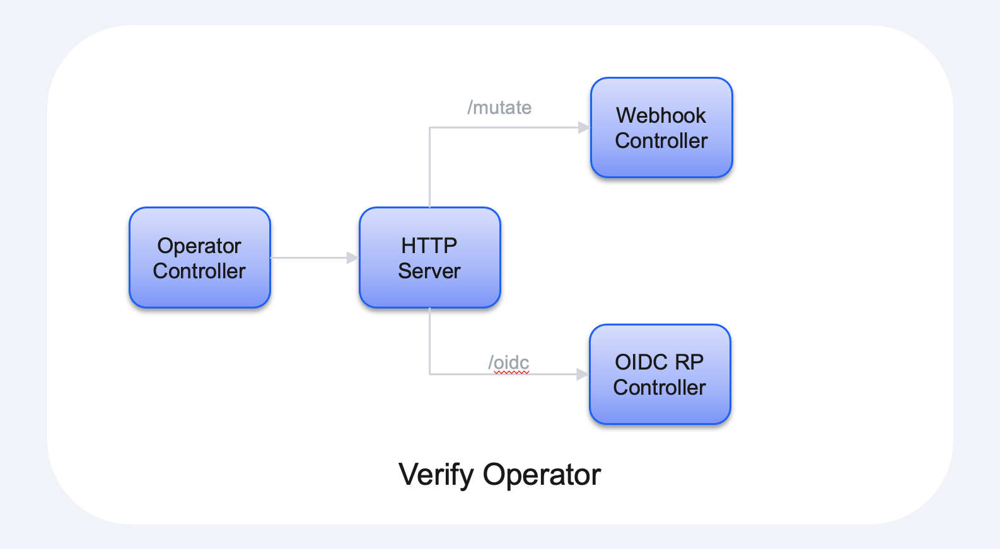

# High Level Design

## Introduction

This document contains a high level design for the Verify Operator.  It will roughly explain how the operator works and the technologies involved.

The operator itself is implemented in the Go programming language.  The 'shell' of the operator has been created by the operator SDK.

At a high level:

1. The operator controller is responsible for managing the IBMSecurityVerify custom resource and starting the HTTP server;
2. The webhook controller is responsible for augmenting the 'Ingress' definitions with the required annotations to configure the Nginx Ingress controller for OIDC authentication.
3. The OIDC controller is responsible for managing the OIDC RP authentication process.



## Operator Controller

The operator controller is pretty simple.  It will just:

1. Start the HTTP server;
2. Watch for IBMSecurityVerify custom resource requests.  When a new custom resource is created the operator will simply validate that the specified clientSecret field corresponds to a known secret, and that the secret contains the required fields.  The required fields include: `client_id`, `client_secret`, `discovery_endpoint`.

A custom resource will look like the following:

```yaml
apiVersion: ibm.com/v1
kind: IBMSecurityVerify

metadata:
  name: ibm-security-verify
  namespace: operators

spec:
  # The name of the secret which contains the IBM Security Verify
  # client credentials.
  clientSecret: ibm-security-verify-client-1cbfe647-9e5f-4d99-8e05-8ec1c862eb47

  # The root URL of the Nginx Ingress controller.
  ingressRoot: https://my-nginx-ingress.apps.acme.ibm.com
```

## HTTP Server

The HTTP server is responsible for receiving Web requests from the Kubernetes admissions controller (aka webhooks), along with requests used during OIDC authentication.

### HTTP Server Certificate

The certificate for the HTTP server will be stored in the `ibm-security-verify-operator` secret.  The secret will have two fields: 

|Field|Description
|-----|-----------
|tls.cert|The server certificate which is used by the HTTP server.
|tls.key|The private key which is used by the HTTP server.

When the operator is first started it will look for the presence of this secret.  If the secret is present it will start the HTTP server using the provided key and certificate.  If the secret is not present it will create a new signed certificate, create the secret and then add the certificate information to the secret.

A description of how to create the signed certificate can be found at the following locations:

* [https://medium.com/@elfakharany/automate-kubernetes-user-creation-using-the-native-go-client-e2d20dcdc9de](https://medium.com/@elfakharany/automate-kubernetes-user-creation-using-the-native-go-client-e2d20dcdc9de)
* [https://medium.com/ovni/writing-a-very-basic-kubernetes-mutating-admission-webhook-398dbbcb63ec](https://medium.com/ovni/writing-a-very-basic-kubernetes-mutating-admission-webhook-398dbbcb63ec)

It is important to note that the certificate must be signed by the Kubernetes signing server, otherwise it is not trusted as a Webhook controller.

## Webhook Controller

The Webhook controller is responsible for intercepting the creation of Ingress definitions and if the 'verify.ibm.com/app.name' annotation is present it will:

1. Check to see if the application has been registered with Verify, based on the presence of the 'ibm\-security\-verify\-client\-\<client\-id>' secret.  If the secret does not currently exist it will:
	1. Register the application with Verify for the tenant which is contained in the custom resource corresponding to the 'verify.ibm.com/cr.name' annotation.  If the annotation is missing the tenant located in the first located 'IBMSecurityVerify' custom resource will be used.
	
	2. Save the generated client ID and secret to a new Kubernetes secret.
	
	> Details on dynamic client registration can be found at the following URLs:
   > 
   >   - [https://www.ibm.com/docs/en/security-verify?topic=applications-openid-connect-dynamic-client-registration#t_dynamic_kc](https://www.ibm.com/docs/en/security-verify?topic=applications-openid-connect-dynamic-client-registration#t_dynamic_kc)
   >   - [https://docs.verify.ibm.com/verify/reference/handledeviceauthorize#handleclientregistrationpost ](https://docs.verify.ibm.com/verify/reference/handledeviceauthorize#handleclientregistrationpost)

2. Add the annotations, via a PATCH operation, to configure the Nginx Ingress operator to call out to the OIDC controller to perform OIDC authentication.

> The following blog contains a good description on how to create a mutating Webhook controller: [https://medium.com/ovni/writing-a-very-basic-kubernetes-mutating-admission-webhook-398dbbcb63ec](https://medium.com/ovni/writing-a-very-basic-kubernetes-mutating-admission-webhook-398dbbcb63ec)

### Nginx Annotations

The following blog contains a good description of how to configure the Nginx Ingress controller for OIDC authentication: [https://developer.okta.com/blog/2018/08/28/nginx-auth-request#configure-your-protected-nginx-host](https://developer.okta.com/blog/2018/08/28/nginx-auth-request#configure-your-protected-nginx-host).

The following annotations will need to be added to the ingress definition by the mutating Webhook:

```yaml
metadata:
  annotations:
    kubernetes.io/ingress.class: "nginx"
    nginx.org/server-snippets: |
            location = /verify-oidc {
                internal;
                
                proxy_pass https://ibm-security-verify-operator/oidc;
                proxy_pass_request_body off; 
                
                proxy_set_header Content-Length "";
                proxy_set_header X-Real-IP $remote_addr;
                proxy_set_header X-Forwarded-For $proxy_add_x_forwarded_for;
                proxy_set_header X-Forwarded-Proto $scheme;

                # these return values are passed to the @error401 call
                auth_request_set $auth_resp_jwt $upstream_http_x_vouch_jwt;
                auth_request_set $auth_resp_err $upstream_http_x_vouch_err;
                auth_request_set $auth_resp_failcount $upstream_http_x_vouch_failcount;
            }
            
            error_page 401 = @error401;

            # If the user is not logged in, redirect them to the login URL
            location @error401 {
                return 302 https://ibm-security-verify-operator/verify-oidc/auth?url=https://$http_host$request_uri&vouch-failcount=$auth_resp_failcount&X-Vouch-Token=$auth_resp_jwt&error=$auth_resp_err&verify-secret=<secret-name>;
            }
            
    nginx.org/location-snippets: |
            auth_request /verify-oidc;

```


## OIDC Controller

The OIDC controller is responsible for the managing of the OIDC authentication flow.  The flow is desribed in the following scenario diagram:

[](https://mermaid-js.github.io/mermaid-live-editor/edit##eyJjb2RlIjoic2VxdWVuY2VEaWFncmFtXG5wYXJ0aWNpcGFudCBVc2VyXG5wYXJ0aWNpcGFudCBJbmdyZXNzIGFzIE5naW54IEluZ3Jlc3NcbnBhcnRpY2lwYW50IE9wZXJhdG9yIGFzIFZlcmlmeSBPcGVyYXRvclxucGFydGljaXBhbnQgQXBwbGljYXRpb25cbnBhcnRpY2lwYW50IFZlcmlmeVxuICAgIFVzZXItPj4rSW5ncmVzczogUmVzb3VyY2UgUmVxdWVzdFxuICAgIG5vdGUgb3ZlciBJbmdyZXNzOiBOZ2lueCBkZXRlY3RzIHRoYXQgPGJyPmF1dGhlbnRpY2F0aW9uIGlzIHJlcXVpcmVkLlxuICAgIEluZ3Jlc3MtPj5PcGVyYXRvcjogR0VUIC92ZXJpZnktb2lkYy9jaGVja1xuICAgIGFjdGl2YXRlIE9wZXJhdG9yXG4gICAgT3BlcmF0b3ItPj5JbmdyZXNzOiAzMDIgL3ZlcmlmeS1vaWRjL2F1dGhcbiAgICBJbmdyZXNzLT4-T3BlcmF0b3I6IEdFVCAvdmVyaWZ5LW9pZGMvYXV0aFxuICAgIG5vdGUgcmlnaHQgb2YgT3BlcmF0b3I6IFRoZSBvcGVyYXRvciBnZW5lcmF0ZXMgPGJyPnRoZSBPSURDIHJlcXVlc3QuXG4gICAgT3BlcmF0b3ItPj5Vc2VyOiAzMDIgUmVkaXJlY3RcbiAgICBkZWFjdGl2YXRlIE9wZXJhdG9yXG4gICAgVXNlci0-PitWZXJpZnk6IEF1dGhvcml6YXRpb24gRW5kcG9pbnRcbiAgICBub3RlIHJpZ2h0IG9mIFZlcmlmeTogVmVyaWZ5IHBlcmZvcm1zIDxicj5hdXRoZW50aWNhdGlvblxuICAgIFZlcmlmeS0-Pi1Vc2VyOiAzMDIgUmVkaXJlY3RcbiAgICBVc2VyLT4-K09wZXJhdG9yOiBHRVQgL3ZlcmlmeS1vaWRjL2F1dGhcbiAgICBPcGVyYXRvci0-PitWZXJpZnk6IFRva2VuIEVuZHBvaW50XG4gICAgVmVyaWZ5LT4-LU9wZXJhdG9yOiBUb2tlbnNcbiAgICBub3RlIHJpZ2h0IG9mIE9wZXJhdG9yOiBUaGUgb3BlcmF0b3IgdmFsaWRhdGVzPGJyPnRoZSB0b2tlblxuICAgIE9wZXJhdG9yLT4-LVVzZXI6IDMwMiBSZWRpcmVjdFxuICAgIFVzZXItPj4rQXBwbGljYXRpb246IFJlc291cmNlIFJlcXVlc3RcbiAgICBBcHBsaWNhdGlvbi0-Pi1Vc2VyOiBSZXNvdXJjZSBSZXNwb25zZVxuICAgICAgICAgICAgIiwibWVybWFpZCI6IntcbiAgXCJ0aGVtZVwiOiBcImRlZmF1bHRcIlxufSIsInVwZGF0ZUVkaXRvciI6ZmFsc2UsImF1dG9TeW5jIjp0cnVlLCJ1cGRhdGVEaWFncmFtIjpmYWxzZX0)

The following endpoints are used by the controller:

|Endpoint|Description
|--------|-----------
|/verify-oidc/check|This is just the kick-off URL for the authentication processing.  It won't do anything by return a 401 so that Nginx will redirect the processing to the '/verify-oidc/auth' endpoint.
|/verify-oidc/auth|This endpoint is the main endpoint for the authentication processing.  It will handle the generation of the redirect to IBM Security Verify for authentication, and the validation of the supplied OIDC JWT after the authentication has completed.

The [Vouch Proxy](https://github.com/vouch/vouch-proxy) project contains an example OIDC-RP implementation which can be referenced for the implementation of this controller.  The [github.com/coreos/go-oidc](https://pkg.go.dev/github.com/coreos/go-oidc#section-readme) package will be used to handle the OIDC specific processing.

