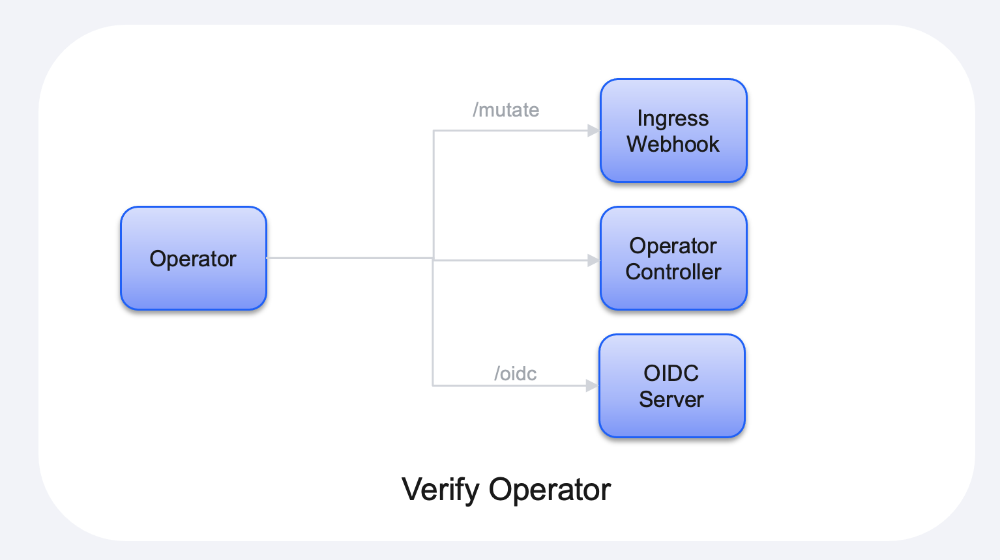

# High Level Design

## Introduction

This document contains a high level design for the Verify Operator.  It will roughly explain how the operator works and the technologies involved.

The operator itself is implemented in the Go programming language.  The 'shell' of the operator has been created by the operator SDK.

At a high level:

1. The operator controller is responsible for managing the IBMSecurityVerify custom resource and starting the HTTP server;
2. The webhook controller is responsible for augmenting the 'Ingress' definitions with the required annotations to configure the Nginx Ingress controller for OIDC authentication.
3. The OIDC controller is responsible for managing the OIDC RP authentication process.



## Operator Controller

The operator controller is pretty simple.  It will just:

1. Start the HTTP server;
2. Watch for IBMSecurityVerify custom resource requests.  We will only support the creation of a single custom resource. We will also need to validate that the tenantSecret field corresponds to a known secret.

> XXX: I don't think that there is any point in allow multiple custom resources to be created.  Otherwise we would need to mandate an additional annotation in the deployment descriptors to explain which 'tenant' needs to be used.

A custom resource will look like the following:

```yaml
apiVersion: ibm.com/v1
kind: IBMSecurityVerify

metadata:
  name: ibm-security-verify
  namespace: operators

spec:
  # The name of the secret which contains the IBM Security Verify
  # tenant information.
  tenantSecret: verify-tenant

  # The root URL of the Nginx Ingress controller.
  ingressRoot: https://my-nginx-ingress.apps.acme.ibm.com
```

## HTTP Server

The HTTP server is responsible for receiving Web requests from the Kubernetes admissions controller (aka webhooks), along with requests used during OIDC authentication.

> XXX: I still need to research how to create the SSL certificate used by the server.

## Webhook Controller

The Webhook controller is responsible for intercepting the creation of Ingress definitions and if the 'verify.ibm.com/app.name' annotation is present it will:

1. Check to see if the application has been registered with Verify, based on the presence of the 'verify\-app\-\<app\-name>' secret.  If the secret does not currently exist it will:
	1. Register the application with Verify;
	2. Save the generated client ID and secret to a new Kubernetes secret.
2. Add the annotations, via a PATCH operation, to configure the Nginx Ingress operator to call out to the OIDC controller to perform OIDC authentication.

> The following blog contains a good description on how to create a mutating Webhook controller: https://medium.com/ovni/writing-a-very-basic-kubernetes-mutating-admission-webhook-398dbbcb63ec

### Annotations

The following blog contains a good description of how to configure the Nginx Ingress controller for OIDC authentication: [https://developer.okta.com/blog/2018/08/28/nginx-auth-request#configure-your-protected-nginx-host](https://developer.okta.com/blog/2018/08/28/nginx-auth-request#configure-your-protected-nginx-host).

The following annotations will need to be added to the deployment/pod definition by the mutating Webhook:

```yaml
# Any request to this server will first be sent to this URL
auth_request /vouch-validate;

location = /vouch-validate {
  # This address is where Vouch will be listening on
  proxy_pass http://127.0.0.1:9090/validate;
  proxy_pass_request_body off; # no need to send the POST body

  proxy_set_header Content-Length "";
  proxy_set_header X-Real-IP $remote_addr;
  proxy_set_header X-Forwarded-For $proxy_add_x_forwarded_for;
  proxy_set_header X-Forwarded-Proto $scheme;

  # these return values are passed to the @error401 call
  auth_request_set $auth_resp_jwt $upstream_http_x_vouch_jwt;
  auth_request_set $auth_resp_err $upstream_http_x_vouch_err;
  auth_request_set $auth_resp_failcount $upstream_http_x_vouch_failcount;
}

error_page 401 = @error401;

# If the user is not logged in, redirect them to Vouch's login URL
location @error401 {
  return 302 https://login.avocado.lol/login?url=https://$http_host$request_uri&vouch-failcount=$auth_resp_failcount&X-Vouch-Token=$auth_resp_jwt&error=$auth_resp_err;
}
```

> XXX: Need to convert this yaml to annotations

> XXX: I still need to work out how to handle multiple ingress definitions for the same host.  Maybe this is not a problem????

## OIDC Controller

The OIDC controller is responsible for the managing of the OIDC authentication flow.  The flow is desribed in the following scenario diagram:

[](https://mermaid-js.github.io/mermaid-live-editor/edit##eyJjb2RlIjoic2VxdWVuY2VEaWFncmFtXG5wYXJ0aWNpcGFudCBVc2VyXG5wYXJ0aWNpcGFudCBJbmdyZXNzIGFzIE5naW54IEluZ3Jlc3NcbnBhcnRpY2lwYW50IE9wZXJhdG9yIGFzIFZlcmlmeSBPcGVyYXRvclxucGFydGljaXBhbnQgQXBwbGljYXRpb25cbnBhcnRpY2lwYW50IFZlcmlmeVxuICAgIFVzZXItPj4rSW5ncmVzczogUmVzb3VyY2UgUmVxdWVzdFxuICAgIG5vdGUgb3ZlciBJbmdyZXNzOiBOZ2lueCBkZXRlY3RzIHRoYXQgPGJyPmF1dGhlbnRpY2F0aW9uIGlzIHJlcXVpcmVkLlxuICAgIEluZ3Jlc3MtPj5PcGVyYXRvcjogR0VUIC92ZXJpZnktb2lkYy9jaGVja1xuICAgIGFjdGl2YXRlIE9wZXJhdG9yXG4gICAgT3BlcmF0b3ItPj5JbmdyZXNzOiAzMDIgL3ZlcmlmeS1vaWRjL2F1dGhcbiAgICBJbmdyZXNzLT4-T3BlcmF0b3I6IEdFVCAvdmVyaWZ5LW9pZGMvYXV0aFxuICAgIG5vdGUgcmlnaHQgb2YgT3BlcmF0b3I6IFRoZSBvcGVyYXRvciBnZW5lcmF0ZXMgPGJyPnRoZSBPSURDIHJlcXVlc3QuXG4gICAgT3BlcmF0b3ItPj5Vc2VyOiAzMDIgUmVkaXJlY3RcbiAgICBkZWFjdGl2YXRlIE9wZXJhdG9yXG4gICAgVXNlci0-PitWZXJpZnk6IEF1dGhvcml6YXRpb24gRW5kcG9pbnRcbiAgICBub3RlIHJpZ2h0IG9mIFZlcmlmeTogVmVyaWZ5IHBlcmZvcm1zIDxicj5hdXRoZW50aWNhdGlvblxuICAgIFZlcmlmeS0-Pi1Vc2VyOiAzMDIgUmVkaXJlY3RcbiAgICBVc2VyLT4-K09wZXJhdG9yOiBHRVQgL3ZlcmlmeS1vaWRjL2F1dGhcbiAgICBPcGVyYXRvci0-PitWZXJpZnk6IFRva2VuIEVuZHBvaW50XG4gICAgVmVyaWZ5LT4-LU9wZXJhdG9yOiBUb2tlbnNcbiAgICBub3RlIHJpZ2h0IG9mIE9wZXJhdG9yOiBUaGUgb3BlcmF0b3IgdmFsaWRhdGVzPGJyPnRoZSB0b2tlblxuICAgIE9wZXJhdG9yLT4-LVVzZXI6IDMwMiBSZWRpcmVjdFxuICAgIFVzZXItPj4rQXBwbGljYXRpb246IFJlc291cmNlIFJlcXVlc3RcbiAgICBBcHBsaWNhdGlvbi0-Pi1Vc2VyOiBSZXNvdXJjZSBSZXNwb25zZVxuICAgICAgICAgICAgIiwibWVybWFpZCI6IntcbiAgXCJ0aGVtZVwiOiBcImRlZmF1bHRcIlxufSIsInVwZGF0ZUVkaXRvciI6ZmFsc2UsImF1dG9TeW5jIjp0cnVlLCJ1cGRhdGVEaWFncmFtIjpmYWxzZX0)

The following endpoints are used by the controller:

|Endpoint|Description
|--------|-----------
|/check|This is just the kick-off URL for the authentication processing.  It won't do anything by return a 401 so that Nginx will redirect the processing to the '/auth' endpoint.
|/auth|This endpoint is the main endpoint for the authentication processing.

> XXX: I still need to flesh out the '/auth' processing.

The [Vouch Proxy](https://github.com/vouch/vouch-proxy) project contains an example OIDC-RP implementation which can be referenced for the implementation of this controller.  The [github.com/coreos/go-oidc](https://pkg.go.dev/github.com/coreos/go-oidc#section-readme) package will be used to handle the OIDC specific processing.

